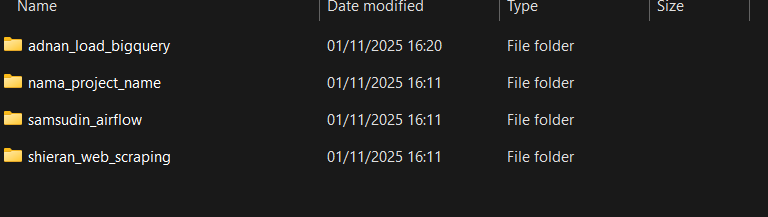

### Task 12 Github
#### Step
  1. Git initialize
```bash
    git init
```
  2. Git add target
```bash
    git remote add origin https://github.com/samsudinr/meet12_jcdeah007
```
  3. Pulling from the repo main branch
```bash
    git pull origin main
```
  4. Check the repo succesfully pulled by ls
```bash
    ls
``` 
Output :
 

  5. Creating new branch "adnan"
```bash
    git branch adnan
``` 
  6. Move to the branch "adnan"
```bash
    git checkout adnan
```
7. Adding folder/file that want to be pushed to the branch
Image of the folder after adding:

8. add .gitignore to exclude file that have credentials
- gitignore:

- with adding "*.json" line that will exclude any json file type.

9. git add
```bash
    git add .
```
- with using "add . " command, this will give instruction to add all subfolder and files in the folder.
  10. Git commit
```bash
    git commit -m "First commit in brach adnan"
```
- This will preparing file that will be pushed to the repo with the message "First commit in brach adnan"
  11. git push to branch
```bash
    git push -u origin adnan
```
- This will be pushing changed file in the branch adnan